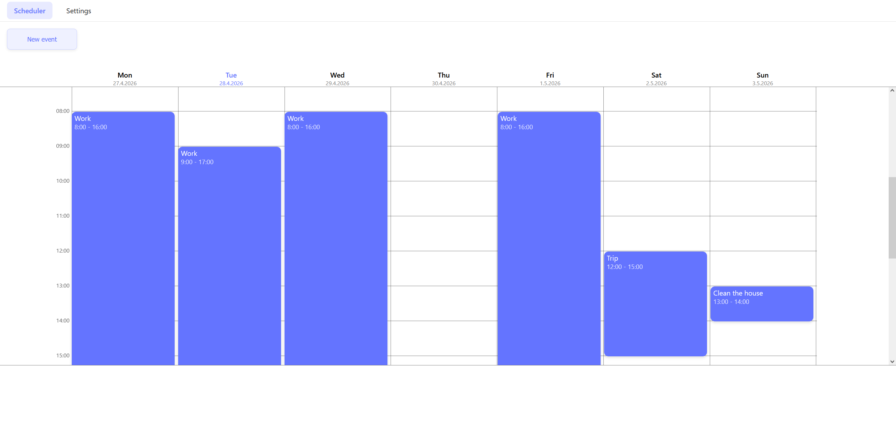

# Week scheduler

Week scheduler is an app that is used for creating and tracking weekly events or tasks. It works on both PC and mobile, as well as any screen from the middle.

This is not meant to be a full calendar app, as there is no way to create events in the future. 
Every event you create is recurring and appear every week.

Events are saved to the browser's localStorage and are loaded when opening the app. 
Importing and exporting schedules is possible with JSON.

</img>

# Features
- Creating new events

- Viewing events (WIP)
- Deleting events (WIP)

- Events save to localStorage
- Importing schedules in JSON format
- Exporting schedules in JSON format
- Page scales to many types of screens
- Mobile view, shows one day at a time
- Clearing all events

# Usage

Site needs to be hosted either locally or on a server to be used.

[VS Code Live Server extension](https://marketplace.visualstudio.com/items?itemName=ritwickdey.LiveServer) can be used to quickly check how the page works.

# Development

1. Clone repository.
2. Launch website with [VS Code Live Server extension](https://marketplace.visualstudio.com/items?itemName=ritwickdey.LiveServer).
3. Any changes made will automatically refresh the website.

# Todo

1. update events to be able to open them to see contents and delete them
DONE 2. fix event text overlapping each other when window is too small
3. fix new event window being too big on iphone SE horizontal

7. line to see what time and day it is
8. style scrollbar
9. Error message if time input is wrong
10. scroll down to current time

11. option to change cell height

Fixes:

- if nav bar buttons are using same colors as new event button and event, change them to variables